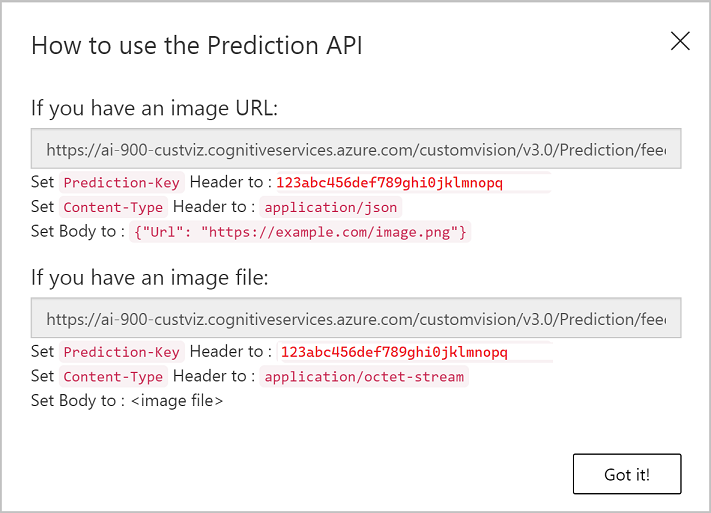
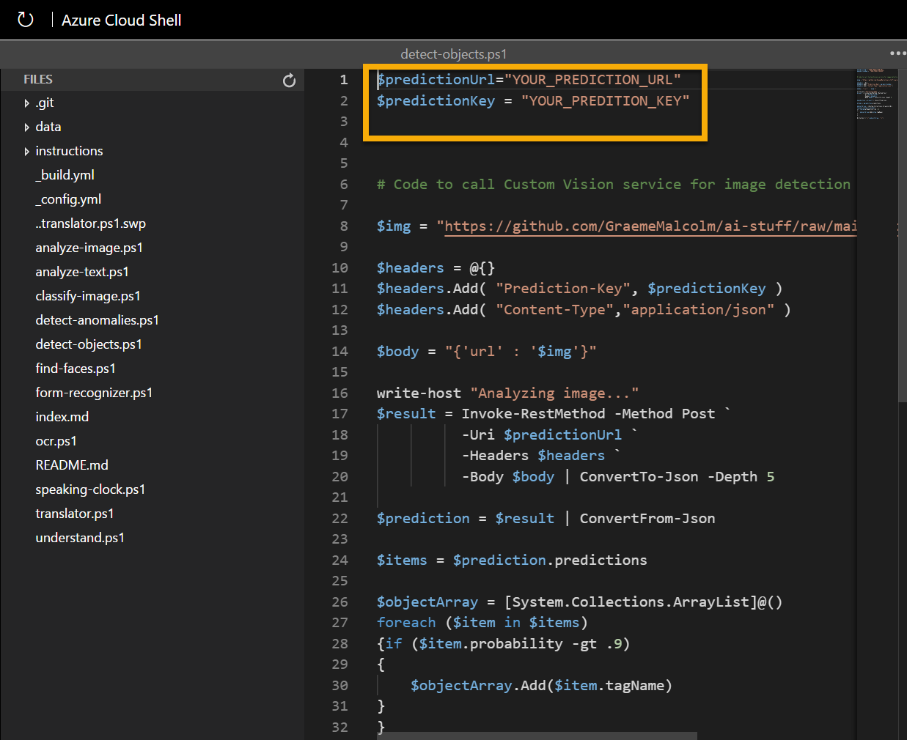

---
lab:
    title: 'Detect objects with the Custom Vision Service'
    module: 'Module 2: Explore Computer Vision'
---

# Detect images with the Custom Vision Service

*Object detection* is a form of computer vision in which a machine learning model is trained to classify individual instances of objects in an image, and indicate a *bounding box* that marks its location. You can think of this as a progression from *image classification* (in which the model answers the question "what is this an image of?") to building solutions where we can ask the model "what objects are in this image, and where are they?".

For example, a grocery store might use an object detection model to implement an automated checkout system that scans a conveyor belt using a camera, and can identify specific items without the need to place each item on the belt and scan them individually.

The **Custom Vision** cognitive service in Microsoft Azure provides a cloud-based solution for creating and publishing custom object detection models.

## Create a Cognitive Services resource

To use the Custom Vision service, you need an Azure resource that you can use to train a model, and a resource with which you can publish it for applications to use. You can use the same resource for each of these tasks, or you can use different resources for each to allocate costs separately provided both resources are created in the same region. The resource for either (or both) tasks can be a general **Cognitive Services** resource, or a specific **Custom Vision** resource. Use the following instructions to create a new **Cognitive Services** resource (or you can use an existing resource if you have one).

Use the following instructions to create a new **Cognitive Services** resource.

1. In a new browser tab, open the Azure portal at [https://portal.azure.com](https://portal.azure.com), and sign in using the Microsoft account associated with your Azure subscription.

2. Click the **&#65291;Create a resource** button, search for *Cognitive Services*, and create a **Cognitive Services** resource with the following settings:
    - **Subscription**: *Your Azure subscription*.
    - **Resource group**: *Select or create a resource group with a unique name*.
    - **Region**: *Choose any available region*:
    - **Name**: *Enter a unique name*.
    - **Pricing tier**: S0
    - **I confirm I have read and understood the notices**: Selected.

3. Wait for the resources to be created. You can view it by navigating to the resource group where you created it.

## Create a Custom Vision project

To train an object detection model, you need to create a Custom Vision project based on your training resource. To do this, you'll use the Custom Vision portal.

1. In a new browser tab, open the Custom Vision portal at [https://customvision.ai](https://customvision.ai), and sign in using the Microsoft account associated with your Azure subscription.
2. Create a new project with the following settings:
    - **Name**: Grocery Detection
    - **Description**: Object detection for groceries.
    - **Resource**: *The resource you created previously*
    - **Project Types**: Object Detection
    - **Domains**: General
3. Wait for the project to be created and opened in the browser.

## Add and tag images

To train an object detection model, you need to upload images that contain the classes you want the model to identify, and tag them to indicate bounding boxes for each object instance.

1. Download and extract the training images from https://aka.ms/fruit-objects. The extracted folder contains a collection of images of fruit.
2. In the Custom Vision portal [https://customvision.ai](https://customvision.ai), make sure you are working in your object detection project _Grocery Detection_. Then select **Add images** and upload all of the images in the extracted folder.


3. After the images have been uploaded, select the first one to open it.

4. Hold the mouse over any object in the image until an automatically detected region is displayed like the image below. Then select the object, and if necessary resize the region to surround it.


Alternatively, you can simply drag around the object to create a region.

5. When the region surrounds the object, add a new tag with the appropriate object type (*apple*, *banana*, or *orange*) as shown here:


6. Select and tag each other object in the image, resizing the regions and adding new tags as required.


7. Use the **>** link on the right to go to the next image, and tag its objects. Then just keep working through the entire image collection, tagging each apple, banana, and orange.

8. When you have finished tagging the last image, close the **Image Detail** editor and on the **Training Images** page, under **Tags**, select **Tagged** to see all of your tagged images:


## Train and test a model

Now that you've tagged the images in your project, you're ready to train a model.

1. In the Custom Vision project, click **Train** to train an object detection model using the tagged images. Select the **Quick Training** option.
2. Wait for training to complete (it might take ten minutes or so), and then review the *Precision*, *Recall*, and *mAP* performance metrics - these measure the prediction accuracy of the object detection model, and should all be high.
3. At the top right of the page, click **Quick Test**, and then in the **Image URL** box, enter `https://aka.ms/apple-orange` and view the prediction that is generated. Then close the **Quick Test** window.

## Publish the object detection model

Now you're ready to publish your trained model and use it from a client application.

9. Click **&#128504; Publish** to publish the trained model with the following settings:
    - **Model name**: detect-produce
    - **Prediction Resource**: *The resource you created previously*.

10. After publishing, click the *Prediction URL* (&#127760;) icon to see information required to use the published model, which should look like this:

    

    Later, you will need the appropriate URL and Prediction-Key values to get a prediction from an Image URL, so keep this dialog box open and carry on to the next task.

## Use a cloud shell

To test the capabilities of the Custom Vision service to detect objects in images, we'll use a simple command-line application that runs in the cloud shell.
> **Note**: For this lab, you will test out an application in a cloud shell environment. When you build your own application, you can use an environment of your choice.

1. Click the **Activate Sandbox** button at the top of the page. This starts a Cloud Shell instance to your right, as shown here. You may be prompted to review permissions. Click **Accept**. 

    

2. When you open the cloud shell, you will need to change the type of shell you are using from *Bash* to *PowerShell*. Type in pwsh and press enter. 

    ```
    pwsh
    ```

## Configure and run a client application

Now that you have a cloud shell environment, you can run a simple client application that uses the Computer Vision service to analyze an image.

1. In the command shell, enter the following command to download the sample application.

    ```
    git clone https://github.com/GraemeMalcolm/ai-stuff ai-900
    ```

2. The files are downloaded to a folder named **ai-900**. Now we want to see all of the files in your cloud shell storage and work with them. Type the following command into the shell: 

     ```
    code .
    ```

    Notice how this opens up an editor. 

3. In the **Files** pane on the left, expand **ai-900** and select **detect-objects.ps1**. This file contains some code that uses the Custom Vision service to detect objects an image, as shown here:

    

4. Don't worry too much about the details of the code, the important thing is that it needs the prediction URL and key for your Custom Vision model when using an image URL. Copy these from the prediction URL dialog box in your Custom Vision project (which should still be open in another browser tab) and paste them into the code editor, replacing the **YOUR_PREDICTION_URL** and **YOUR_PREDICTION_KEY** placeholder values respectively.
    
    
    After pasting the endpoint and key values, the first two lines of code should look similar to this:

    ```PowerShell
    $predictionUrl="https://mycv.cognitiveservices.azure.com/.../detect-groceries/url"
    $predictionKey = "123abc456def789ghi0klmnopq"
    ```

5. At the top right of the editor pane, use the **...** button to open the menu and select **Save** to save your changes. Then open the menu again and select **Close Editor**.

    You will use the sample client application to detect objects in this image:

    

6. In the PowerShell pane, enter the following command to run the code:

    ```
    cd ai-900
    .\detect-objects.ps1 
    ```

7. Review the prediction, which should be *apple orange banana**.

## Learn more

This simple app shows only some of the capabilities of the Custom Vision service. To learn more about what you can do with this service, see the [Custom Vision page](https://azure.microsoft.com/services/cognitive-services/custom-vision-service/).
