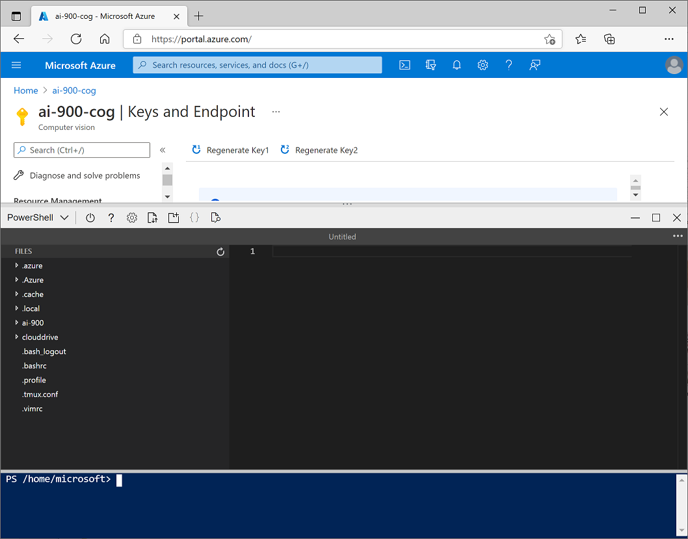

---
lab:
    title: 'Analyze Faces with the Face Service'
    module: 'Module 1: Explore Computer Vision'
---

# Analyze Faces with the Face Service

Computer vision solutions often require an artificial intelligence (AI) solution to be able to detect, analyze, or identify human faces. or example, suppose the retail company Northwind Traders has decided to implement a "smart store", in which AI services monitor the store to identify customers requiring assistance, and direct employees to help them. One way to accomplish this is to perform facial detection and analysis - in other words, determine if there are any faces in the images, and if so analyze their features.

## Create a *Face* resource

Let's start by creating a **Face** resource in your Azure subscription:

1. In another browser tab, open the Azure portal at [https://portal.azure.com](https://portal.azure.com?azure-portal=true), signing in with your Microsoft account.
2. Click the **&#65291;Create a resource** button, search for *Computer Vision*, and create a **Computer Vision** resource with the following settings:
    - **Subscription**: *Your Azure subscription*.
    - **Resource group**: *Select an existing resource group or create a new one*.
    - **Region**: *Choose any available region*
    - **Name**: *Enter a unique name*.
    - **Pricing tier**: Free F0
    - **Notices**: *Scroll down if necessary, and select any required checkbox for notices relevant to your selected region*.

3. Review and create the resource, and wait for deployment to complete. Then go to the deployed resource.
4. View the **Keys and Endpoint** page for your Computer Vision resource. You will need the endpoint and keys to connect from client applications.

## Create a cloud shell

To test the capabilities of the Computer Vision service, we'll use a simple command-line application that runs in the cloud shell provided with your Azure subscription.

1. In the Azure portal, select the [**>_**] (*Cloud Shell*) button at the top of the page to the right of the search box. This opens a Cloud Shell pane at the bottom of the portal, as shown here.

    

2. The first time you open the cloud shell, you will be prompted to choose the type of shell you want to use (*Bash* or *PowerShell*). Select **PowerShell**.
3. If you are prompted to create storage for your cloud shell, ensure your subscription is specified and select **Create storage**. Then wait a minute or so for the storage to be created. Eventually, the cloud shell pane will display a command prompt like this:

    

    > **Note**: If you selected *Bash*, or you had previously opened a Bash cloud shell, you can switch to PowerShell by using the drop-down menu at the top left of the cloud shell pane.

## Configure and run a client application

Now that you have a cloud shell environment, you can run a simple client application that uses the Computer Vision service to analyze an image.

1. In the command shell, enter the following command to download the sample application.

    ```
    git clone https://github.com/GraemeMalcolm/ai-stuff ai-900
    ```

2. The files are downloaded to a folder named **ai-900**. To see all of the files in your cloud shell storage, select the **{ }** (*Open editor*) icon on the bar at the top of the cloud shell pane. This opens an additional editor pane above the cloud shell pane, like this:

    

3. Use the separator bar above the editor pane to resize it so you can see more clearly, and then in the **Files** pane on the left, expand **ai-900** and select **find-faces.ps1**. This file contains some code that uses the Face service to detect and analyze faces in an image, as shown here:

    

4. Don't worry too much about the details of the code, the important thing is that it needs the endpoint URL and either of the keys for your Face resource. Copy these from the **Keys and Endpoints** page for your resource (which should still be in the top area of the browser) and paste them into the code editor, replacing the **YOUR_ENDPOINT** and **YOUR_KEY** placeholder values respectively.

    >**Tip**: You may need to use the separator bar to adjust the screen area as you work with the **Keys and Endpoint** and **Editor** panes.

    After pasting the endpoint and key values, the first two lines of code should look similar to this:

    ```PowerShell
    $endpoint="https://resource.cognitiveservices.azure.com/"
    $key="1a2b3c4d5e6f7g8h9i0j...."
    ```

5. At the top right of the editor pane, use the **...** button to open the menu and select **Save** to save your changes. Then open the menu again and select **Close Editor**.

    The sample client application will use your Face service to analyze the following image, taken by a camera in the Northwind Traders store:

    

6. In the PowerShell pane, enter the following command to run the code:

    ```
    .\ai-900\find-faces.ps1 store-cam1.jpg
    ```

7. Review the details of the faces found in the image, which include:
    - The location of the face in the image
    - The approximate age of the person
    - An indication of the emotional state of the person (based on proportional scores for a range of emotions)

    Note that the location of a face is indicated by the top- left coordinates, and the width and height of a *bounding box*, as shown here:

    

8. Now let's try another image:

    

    To analyze the second image, enter the following command:

    ```
    .\ai-900\find-faces.ps1 store-cam2.jpg
    ```

9. Review the results of the face analysis for the second image.

10. Let's try one more:

    

    To analyze the third image, enter the following command:

    ```
    .\ai-900\find-faces.ps1 store-cam3.jpg
    ```

11. Review the results of the face analysis for the third image.

## Learn more

This simple app shows only some of the capabilities of the Face service. To learn more about what you can do with this service, see the [Face page](https://azure.microsoft.com/services/cognitive-services/face/).
