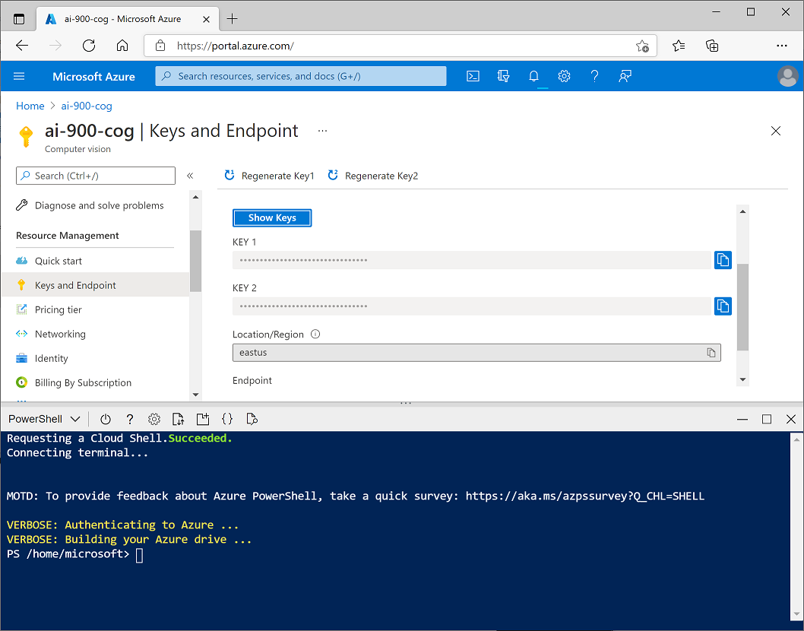

---
lab:
    title: 'Analyze Receipts with Form Recognizer'
    module: 'Module 1: Explore Computer Vision'
---

# Analyzing Receipts with Form Recognizer 

In the artificial intelligence (AI) field of computer vision, optical character recognition (OCR) is commonly used to read printed or handwritten documents. Often, the text is simply extracted from the documents into a format that can be used for further processing or analysis.

A more advanced OCR scenario is the extraction of information from forms, such as purchase orders or invoices, with a semantic understanding of what the fields in the form represent. The **Form Recognizer** service is specifically designed for this kind of AI problem.

## Create a Form Recognizer resource

>**Note:** You can either use a Cognitive Service resource or a Form Recognizer resource to access Form Recognizer services. 

To create a Form Recognizer resource in your Azure subscription:

1. In another browser tab, open the Azure portal at https://portal.azure.com, signing in with your Microsoft account.
2. Select **+ Create a resource**, and search for *Form Recognizer*.
3. In the list of services, select **Form Recognizer**.
4. In the **Form Recognizer** blade, select **Create**.
5. In the **Create** blade, enter the following details and select **Create**
   - **Name**: A unique name for your service
   - **Subscription**: Your Azure subscription
   - **Region**: Any available region
   - **Pricing tier**: F0
   - **Resource Group**: The existing resource group you used previously
   - **I confirm I have read and understood the notice below**: Selected.
6. Review and create the resource, and wait for deployment to complete. Then go to the deployed resource.
7. View the **Keys and Endpoint** page for your Cognitive Services resource. You will need the endpoint and keys to connect from client applications.

## Create a cloud shell

To test the capabilities of Form Recognizer with Cognitive Services, we'll use a simple command-line application that runs in the cloud shell provided with your Azure subscription.

1. In the Azure portal, select the [**>_**] (*Cloud Shell*) button at the top of the page to the right of the search box. This opens a Cloud Shell pane at the bottom of the portal, as shown here.

    

2. The first time you open the cloud shell, you will be prompted to choose the type of shell you want to use (*Bash* or *PowerShell*). Select **PowerShell**.

3. If you are prompted to create storage for your cloud shell, ensure your subscription is specified and select **Create storage**. Then wait a minute or so for the storage to be created. Eventually, the cloud shell pane will display a command prompt like this:

    

    > **Note**: If you selected *Bash*, or you had previously opened a Bash cloud shell, you can switch to PowerShell by using the drop-down menu at the top left of the cloud shell pane.

## Configure and run a client application

Now that you have a cloud shell environment, you can run a simple client application that uses Form Recognizer to analyze a receipt.

1. In the command shell, enter the following command to download the sample application. 

    ```
    git clone https://github.com/GraemeMalcolm/ai-stuff ai-900
    ```

2. The files are downloaded to a folder named **ai-900**. To see all of the files in your cloud shell storage, select the **{ }** (*Open editor*) icon on the bar at the top of the cloud shell pane. This opens an additional editor pane above the cloud shell pane, like this:

    

3. Use the separator bar above the editor pane to resize it so you can see more clearly, and then in the **Files** pane on the left, expand **ai-900** and select **form-recognizer.ps1**. This file contains some code that uses the Form Recognizer service to analyze the fields in a receipt, as shown here:

    NEED IMAGE 

4. Don't worry too much about the details of the code, the important thing is that it needs the endpoint URL and either of the keys for your Form Recognizer resource. Copy these from the **Keys and Endpoints** page for your resource (which should still be in the top area of the browser) and paste them into the code editor, replacing the **YOUR_ENDPOINT** and **YOUR_KEY** placeholder values respectively.

    >**Tip**: You may need to use the separator bar to adjust the screen area as you work with the **Keys and Endpoint** and **Editor** panes.

    After pasting the endpoint and key values, the first two lines of code should look similar to this:

    ```PowerShell
    $endpoint="https://resource.cognitiveservices.azure.com/"
    $key="1a2b3c4d5e6f7g8h9i0j...."
    ```

5. At the top right of the editor pane, use the **...** button to open the menu and select **Save** to save your changes. Then open the menu again and select **Close Editor**. Now that you've set up the key and endpoint, you can use your resource to analyze fields from a receipt.

    Let's start with the **Form Recognizer** API, which enables you to -------------. In this case, you'll use the Form Recognizer's built-in model to analyze a receipt for the fictional Northwind Traders retail company.

    The sample client application will analyze the following image:

    

6. In the PowerShell pane, enter the following commands to run the code to read the text:

    ```
    cd ai-900
    .\form-recognizer.ps1 
    ```

7. Review the details found in the image. The text found in the image is organized into a hierarchical structure of regions, lines, and words, and the code reads these to retrieve the results.

    Note that the location of text is indicated by the top- left coordinates, and the width and height of a *bounding box*, as shown here:

    

## Learn more

This simple app shows only some of the Form Recognizer capabilities of the Computer Vision service. To learn more about what you can do with this service, see the [Form Recognizer page](https://docs.microsoft.com/azure/applied-ai-services/form-recognizer/overview).