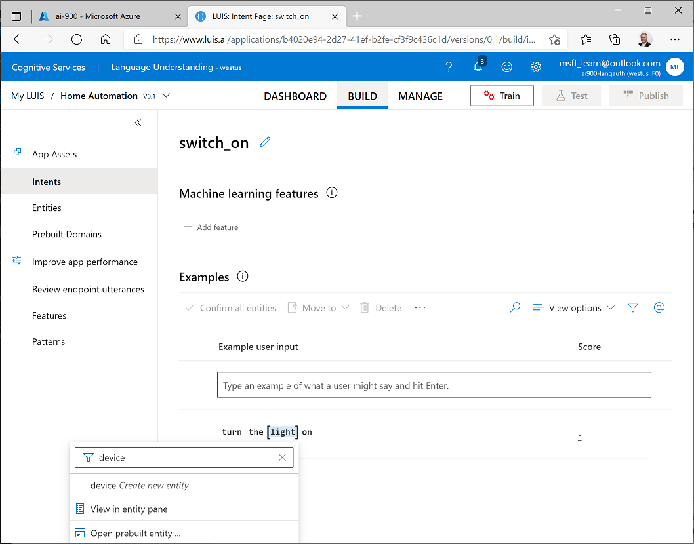
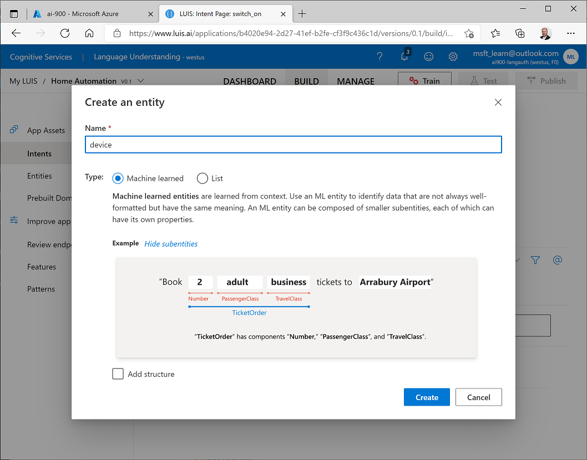
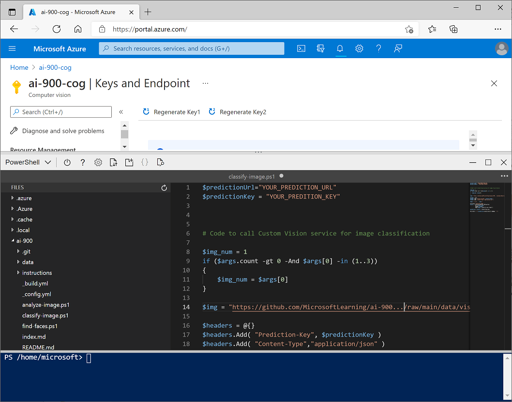

---
lab:
    title: 'Understand Language'
    module: 'Module 3: Explore Natural Language Processing'
---
# Understand Language

Increasingly, we expect computers to be able to use AI in order to understand spoken or typed commands in natural language. For example, you might want to implement a home automation system that enables you to control devices in your home by using voice commands such as "switch on the light" or "put the fan on", and have an AI-powered device understand the command and take appropriate action.

## Create Authoring and Prediction Resources

Microsoft cognitive services includes the Language Understanding service, which enables you to define *intents* that are applied to *entities* based on *utterances*. You can use either a **Language Understanding** or  **Cognitive Services** resource to *publish* a Language Understanding app, but you must create a separate **Language Understanding** resource for *authoring* the app.

1. In another browser tab, open the Azure portal at [https://portal.azure.com](https://portal.azure.com), signing in with your Microsoft account.
2. Click **+ Create a resource**, and search for *Language Understanding*.
3. In the list of services, click **Language Understanding**.
4. In the **Language Understanding** blade, click **Create**.
5. In the **Create** blade, enter the following details and click **Create**
    - **Create option**: Both
    - **Subscription**: *Select your Azure subscription*
    - **Resource Group**: *Select an existing resource group or create a new one*
    - **Name**: *A unique name for your service*
    - **Authoring location**: *Select any available location*
    - **Authoring pricing tier**: Free F0
    - **Runtime location**: *Same as authoring location*
    - **Runtime pricing tier**: Free F0
6. Wait for the resources to be created, and note that two Language Understanding resources are provisioned; one for authoring, and another for prediction. You can view these by navigating to the resource group where you created them.

### Create a Language Understanding App

To implement natural language understanding with Language Understanding, you create an app; and then add entities, intents, and utterances to define the commands you want the app to understand:

1. In a new browser tab, open the Language Understanding portal at [https://www.luis.ai](https://www.luis.ai), and sign in using the Microsoft account associated with your Azure subscription. If this is the first time you have signed into the Language Understanding portal, you may need to grant the app some permissions to access your account details. Then complete the *Welcome* steps by selecting the existing Language Understanding authoring resource you just created in your Azure subscription. 
2. In the **Conversation apps** page, create a new app with the following settings:
    - **Name**: Home Automation
    - **Culture**: English
    - **Description**: Simple home automation
    - **Prediction resource**: *Your Language Understanding prediction resource*
3. If a panel with tips for creating an effective Language Understanding app is displayed, close it.

### Create intents and entities

An *intent* is an action you want to perform - for example, you might want to switch a light on, or turn a fan off. In this case, you'll define two intents: one to switch a device on, and another to switch a device off. For each intent, you'll specify sample *utterances* that indicate the kind of language used to indicate the intent.

1. In the pane on the left, ensure that **Intents** is selected Then click **Create**, and add an intent with the name **switch_on** and click **Done**.
2. Under the **Examples** heading and the **Example user input** subheading, type the utterance ***turn the light on*** and press **Enter** to submit this utterance to the list.
3. In the *turn the light on* utterance, select the word "light". Then in the list that appears, in the *Enter an entity name* box type **device** and select ***device* Create new entity**, as shown here:

    

4. In the **Create an Entity** dialog box that is displayed, create a **machine learned** entity named **device*.

    

5. Back in the page for the **switch_on** intent, create a second utterance with the phrase ***switch on the fan***. Then select the word "fan" and assign it to the **device** entity you created previously.
6. In the pane on the left, click **Intents** and verify that your **switch_on** intent is listed along with the default **None** intent, Then click **Create** and add a new intent with the name **switch_off**.
7. In the page for the **switch_off** intent, add the utterance ***turn the light off*** and assign the word "light" to the **device** entity.
8. Add a second utterance to the **switch_off** intent, with the utterance ***switch off the fan***. Then connect the word "fan" to the **device** entity.

### Train and Test the Language Model

Now you're ready to use the intents and entities you have defined to train the language model for your app.

1. At the top of the Language Understanding page for your app, click **Train** to train the language model
2. When the model is trained, click **Test**, and use the test pane to view the predicted intent for the following phrases, noting the predicted intent and *inspecting* the details to identify predicted ML entities.
    * *switch the light on*
    * *turn off the fan*
    * *put the light on*
    * *put the fan off*
3. Close the Test pane.

### Publish the Model and Configure Endpoints

To use your trained model in a client application, you must publish it as an endpoint to which the client applications can send new utterances; from which intents and entitites will be predicted.

1. At the top of the Language Understanding page for your app, click **Publish**. Then select **Production slot** and click **Done**.
2. After the model has been published, at the top of the Language Understanding page for your app, click **Manage**. Then on the **Settings** tab, note the **Application ID** for your app. You will need this value later.
3. On the **Azure Resources** tab, note the **Primary key** and **Endpoint URL** for your prediction resource. You will also need these later.

## Use your Language Understanding app from a client

To consume your language model from a client, we'll use a simple command-line application that runs in the cloud shell provided with your Azure subscription.

## Create a cloud shell

Firs, you'll need a clioud shell in which to run the app.

1. Switch to the browser tab containing the Azure portal, and select the [**>_**] (*Cloud Shell*) button at the top of the page to the right of the search box. This opens a Cloud Shell pane at the bottom of the portal, as shown here.

    

2. The first time you open the cloud shell, you will be prompted to choose the type of shell you want to use (*Bash* or *PowerShell*). Select **PowerShell**.
3. If you are prompted to create storage for your cloud shell, ensure your subscription is specified and select **Create storage**. Then wait a minute or so for the storage to be created. Eventually, the cloud shell pane will display a command prompt like this:

    

    > **Note**: If you selected *Bash*, or you had previously opened a Bash cloud shell, you can switch to PowerShell by using the drop-down menu at the top left of the cloud shell pane.

## Configure and run a client application

Now that you have a cloud shell environment, you can run a simple client application that uses the Computer Vision service to analyze an image.

1. In the command shell, enter the following command to download the sample application.

    ```
    git clone https://github.com/GraemeMalcolm/ai-stuff ai-900
    ```

2. The files are downloaded to a folder named **ai-900**. To see all of the files in your cloud shell storage, select the **{ }** (*Open editor*) icon on the bar at the top of the cloud shell pane. This opens an additional editor pane above the cloud shell pane, like this:

    

3. Use the separator bar above the editor pane to resize it so you can see more clearly, and then in the **Files** pane on the left, expand **ai-900** and select **understand.ps1**. This file contains some code that uses your Custom Vision model to classify an image, as shown here:

    

4. Don't worry too much about the details of the code, the important thing is that it needs the application ID, key, and endpoint URL for your published language model. Copy these from the **Manage** page in th Language Understanding portal (which should still be open in another browser tab) and paste them into the code editor, replacing the **YOUR_APP_ID**, **YOUR_PRIMARY_KEY** and **YOUR_ENDPOINT_URL** placeholder values respectively.

    After pasting the endpoint and key values, the first two lines of code should look similar to this:

    ```PowerShell
    $appId="abc-123-456-def..."
    $key = "123abc456def789ghi0klmnopq"
    $endpointUrl="YOUR_ENDPOINT_URL"
    ```

5. At the top right of the editor pane, use the **...** button to open the menu and select **Save** to save your changes. Then open the menu again and select **Close Editor**.
7. In the PowerShell pane, enter the following command to run the code:

    ```
    .ai-900\understand.ps1 "Turn on the light"
    ```